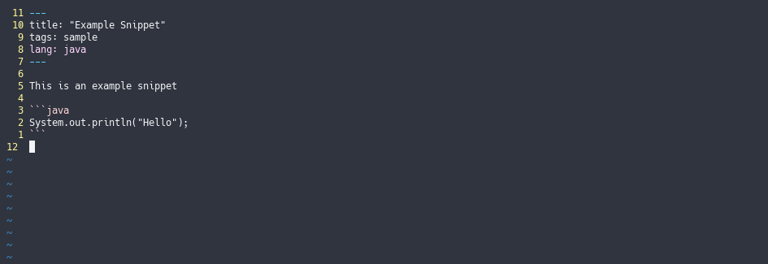

# snipster
> A simple cli snippet manager

[](https://github.com/sophieau/snipster/releases)
[](https://pypi.python.org/pypi/snipster-py)

[](https://github.com/SophieAu/snipster/issues)
[](https://github.com/SophieAu/snipster/blob/master/LICENSE)


snipster is a command line snippet manager allowing you to view, edit, create and copy snippets from your command line. It follows the Unix philosophy of "do one thing and do it well". 

[Installation](#installation) | [Setup](#setup) | [Usage](#usage) | [Troubleshooting](#troubleshooting) | [Other](#other) | [Credits](#credits)


## Installation

snipster is available on [PyPI](https://pypi.python.org/pypi/snipster-py). This is the easiest way to install it. All dependencies will be installed automatically.

```sh
pip3 install snipster-py
```

If you want to install snipster from source, have a look [here](#install-from-source)


## Setup
When you first start up snipster, you should run
```sh
snipster source
```
This will create a ``.snipster`` directory in your home folder (if it does not already exist) and create an empty snippet list.


## Usage

```
snipster source
snipster list
snipster list [-t <tag>... | -l <language>... | -k <keyword>... ]...
snipster (-c|-e|-o) [-f] <snippet-id>
snipster -h | --help
snipster -v | --version
```

### Listing (And Filtering) All Snippets


You can filter by tag (``-t``), keyword in the title (``-k``) and language (``-l``). If the filters result in only one match, the match will be displayed directly (instead of a list with only one entry).


### Creating/Editing A Snippet


When you create a snippet, an empty file will be created in ``~/.snipster`` and opened in your ``$EDITOR``. For this snippet to be read as valid, it needs to have yaml frontmatter and the actual snippet code needs to be marked as such. You do not need to have any attributes in the front matter but they are heavily encouraged. Valid attributes are ``tags``, ``lang``, ``title``.
**An id is not necessary.** It will be automatically assigned by snipster when you source again.



In order for (changes to) a snippet to be recognized you need to ``snipster source`` after saving.


### Viewing A Snippet


### Copying A Snippet To The Clipboard


## Troubleshooting

#### Bug Reports and Feature Requests
Bug reports and feature requests are very much appreciated. Please contact me on Twitter ([@SolviAu](https://twitter.com/solviau)) or open an issue [here](https://github.com/SophieAu/snipster/issues/new).


## Other

#### Install From Source
If you do not want to use pip, you can "install" snipster by simply cloning the repo onto your local machine or downloading the latest release from [here](https://github.com/sophieau/snipster/releases)

```sh
git clone https://github.com/SophieAu/snipster.git
```

Then, you need to add the file ``snipster`` to your path. the easiest way to do that is to symbolically link to it from the ``bin`` directory

```sh
ln -s snipster/src/snipster ~/bin/
```

snipster also needs a few dependencies to function properly. Make sure they are installed
* [Pygments 2.2.0](http://pygments.org/) (for the syntax highlighting)
* [pyperclip 1.6.0](https://github.com/asweigart/pyperclip) (to copy snippets to the clipboard)
* [tabulate 0.8.2](https://bitbucket.org/astanin/python-tabulate) (to display the snippet list in a table)


## Credits
This project was heavily inspired by [cheat](https://github.com/chrisallenlane/cheat), a command line cheat sheet viewer/creator

---
> [sophieau.github.io](https://sophieau.github.io) – Twitter [@SolviAu](https://twitter.com/solviau) – © 2018, [MIT Licence](LICENSE)
